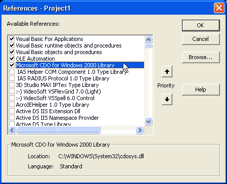

<div align="center">

## Send EMAIL your local machine with/without SMTP


</div>

### Description

Send your emails without SMTP email server on your local machine. You cand create email list and send emails your list ! Easy & powerful !

Thanx for votes..
 
### More Info
 
Microsoft CDO for Windows 2000 (XP,2000,2003)


<span>             |<span>
---                |---
**Submitted On**   |
**By**             |[B\.Cem HANER](https://github.com/Planet-Source-Code/PSCIndex/blob/master/ByAuthor/b-cem-haner.md)
**Level**          |Intermediate
**User Rating**    |5.0 (20 globes from 4 users)
**Compatibility**  |VB 4\.0 \(32\-bit\), VB 5\.0, VB 6\.0
**Category**       |[Internet/ HTML](https://github.com/Planet-Source-Code/PSCIndex/blob/master/ByCategory/internet-html__1-34.md)
**World**          |[Visual Basic](https://github.com/Planet-Source-Code/PSCIndex/blob/master/ByWorld/visual-basic.md)
**Archive File**   |[](https://github.com/Planet-Source-Code/b-cem-haner-send-email-your-local-machine-with-without-smtp__1-57270/archive/master.zip)


### Source Code

```
You must add tis reference your project:
Microsoft CDO for Windows 2000 (XP,2000,2003)
Insert this code Command1_Click event. And run !
Ok john. Please dont worry and don't
hate :) If you are using SMTP server
please add this lines.. Goog luck
!
If you are using SMTP server please add this lines your code.
'------------------
Mail.Configuration.Fields.Item("smtpserver") = "smtp.yourserver.com"
Mail.Configuration.Fields.Item("smtpserverport") = 25
Mail.Configuration.Fields.Update
------ STANDART TEXT MESSAGE SEND -----------
Dim Mail As CDO.Message
Set Mail = New CDO.Message
Mail.From = "yourmailORother@mail.com"
Mail.To = "alexis@mail.com"
Mail.Subject = "Your subject"
Mail.TextBody = "MySubject"
Mail.Send
:) OK Your mail is sent !
------ USING CC & BCC FIELDS ------------
Dim Mail As CDO.Message
Set Mail = New CDO.Message
Mail.Subject="Sending email with CDO"
Mail.From="mymail@mydomain.com"
Mail.To="someone@somedomain.com"
Mail.Bcc="someoneelse@somedomain.com"
Mail.Cc="someoneelse2@somedomain.com"
Mail.TextBody="This is a message."
Mail.Send
------ SENDING HTML TYPED MAIL ------------
Dim Mail As CDO.Message
Set Mail = New CDO.Message
Mail.Subject="Sending email with CDO"
Mail.From="mymail@mydomain.com"
Mail.To="someone@somedomain.com"
Mail.HTMLBody = "<h1>This is a message.</h1>"
Mail.Send
------ SENDING HTML MAIL FROM WEB PAGE ----------
Dim Mail As CDO.Message
Set Mail = New CDO.Message
Mail.Subject="Sending email with CDO"
Mail.From="mymail@mydomain.com"
Mail.To="someone@somedomain.com"
Mail.CreateMHTMLBody "http://www.w3schools.com/asp/"
Mail.Send
%>
------ SENDING HTML MAIL FROM WEB PAGE ----------
Dim Mail As CDO.Message
Set Mail = New CDO.Message
Mail=CreateObject("CDO.Message")
Mail.Subject="Sending email with CDO"
Mail.From="mymail@mydomain.com"
Mail.To="someone@somedomain.com"
Mail.CreateMHTMLBody "c:\webs\test.htm"
Mail.Send
------ SENDING MAIL WITH ATTACHMENT OPTION -----
Dim Mail As CDO.Message
Set Mail = New CDO.Message
Mail.Subject="Sending email with CDO"
Mail.From="mymail@mydomain.com"
Mail.To="someone@somedomain.com"
Mail.TextBody="This is a message."
Mail.AddAttachment "c:\mydocuments\test.txt"
Mail.Send
```

